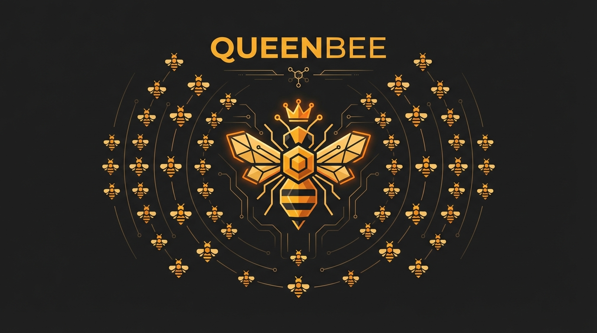

# Queen CLI

The Queen CLI provides orchestration and coordination capabilities for multi-agent development workflows.

## Installation

```bash
cd queen
go build -o queen ./cmd/queen
# Optionally move to your PATH
mv queen /usr/local/bin/
```

## Configuration

Queen uses a `.queen.yaml` file in your project root:

```yaml
agent: ui-engineer        # Your agent identity (or use --agent flag)
auto_assign:
  enabled: true
  default_agent: triage-agent
agents:                   # Registered agents
  - name: ui-engineer
    skills:
      - frontend
      - react
  - name: growth-engineer
    skills:
      - backend
      - analytics
```

### Setting Your Agent Identity

Multiple methods, in priority order:

1. `--agent` flag: `queen msg send --agent=ui-engineer queen "Hello"`
2. `QUEEN_AGENT` env var: `export QUEEN_AGENT=ui-engineer`
3. Config file `agent` key in `.queen.yaml`

## Commands

### Daemon Management

```bash
queen start              # Start the queen daemon
queen stop               # Stop the queen daemon
queen status             # Check daemon status
```

### Live Monitoring

```bash
queen watch              # Live dashboard (refreshes every 5s)
queen watch -i 2s        # Refresh every 2 seconds
```

The watch dashboard shows:
- **Issues**: Total count with open/blocked/ready breakdown
- **Agents**: Registered agents with assigned/idle counts
- **Queue**: Work queue status (ready/blocked)
- **Messages**: Inbox counts (total/unread/urgent)

Delta indicators show changes between refreshes: `(+2)`, `(-1)`, `(=)`

### Messaging

```bash
# Send a message
queen msg send <recipient> "<message>"
queen msg send queen "Starting work on qb-42"

# Broadcast to all agents
queen msg send @all "System maintenance in 5 minutes"

# Check inbox
queen msg inbox
queen msg inbox --since="1 hour ago"

# Reply to a message
queen msg reply <msg-id> "Acknowledged"

# View thread
queen msg thread qb-42
```

### Assignments

```bash
# Assign issue to agent
queen assign <issue-id> <agent>
queen assign qb-42 ui-engineer

# Claim issue for yourself
queen claim <issue-id>

# Release assignment
queen release <issue-id>

# List assignments
queen assignments
queen assignments --agent=ui-engineer
```

### File Reservations

```bash
# Reserve files before editing
queen reserve src/components/**
queen reserve --exclusive src/api/auth.ts

# Check reservations
queen reserved
queen reserved --path=src/components

# Release reservations
queen unreserve src/components/**
queen unreserve --all
```

### Configuration

```bash
# Get config value
queen config get agent

# Set config value
queen config set agent ui-engineer
queen config set auto_assign.enabled true
```

### Agent Registry

```bash
# List registered agents
queen registry list
queen registry list --json

# Show registry configuration
queen registry show
```

## Agent Protocol

### Session Start

```bash
# 1. Check assigned work
bd list --assigned-to=ui-engineer

# 2. Check inbox
queen msg inbox

# 3. Claim work
queen claim qb-42

# 4. Reserve files
queen reserve src/components/**

# 5. Announce
queen msg send queen "[qb-42] Starting: Implementation"
```

### Session End

```bash
# 1. Release reservations
queen unreserve --all

# 2. Update issue status
bd close qb-42 --reason="Completed"

# 3. Send completion message
queen msg send queen "[qb-42] Completed: All acceptance criteria met"

# 4. Sync and push
bd sync
git add . && git commit -m "feat: implement qb-42"
git push
```

## Architecture

Queen extends Beads with coordination capabilities:

```
.beads/
├── issues.jsonl              # Standard Beads issues
├── queen_assignments.jsonl   # Agent-to-issue mappings
├── queen_messages.jsonl      # Inter-agent communication
└── queen_reservations.jsonl  # File reservation claims
```

All state is Git-backed JSONL - no SQLite, no HTTP servers.

## Development

```bash
# Run tests
go test ./...

# Build
go build -o queen ./cmd/queen

# Run with verbose logging
QUEEN_DEBUG=1 queen status
```

## License

MIT
