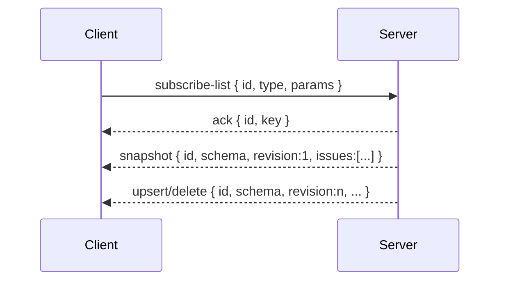
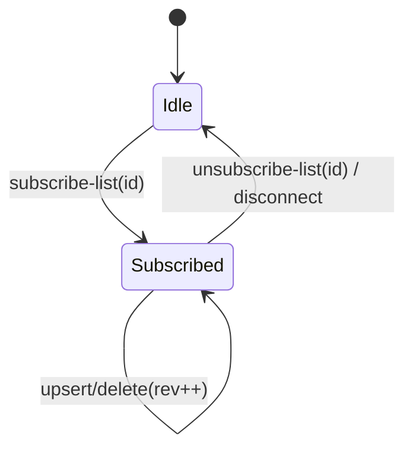

# Subscription Push Protocol — per‑subscription full‑issue envelopes (Breaking)

```
Date: 2025-10-26
Status: Implemented
Owner: agent
```

This document specifies the push‑only protocol used by beads‑ui to deliver list
updates from the local server to the client. It replaces the legacy
notify‑then‑fetch model. There is no version negotiation or fallback.

## Overview

- Transport: single WebSocket connection per client
- Encoding: JSON text frames
- Subscriptions: one client‑chosen `id` per active list subscription
- Delivery: per‑subscription envelopes with full issue payloads
- Messages: `snapshot` | `upsert` | `delete`
- Ordering: strictly increasing `revision` per subscription key and connection

## Envelopes

```ts
export type SnapshotEnvelope = {
  type: 'snapshot';
  id: string; // client subscription id
  revision: number; // starts at 1 and increments per envelope
  issues: Issue[]; // full list for this subscription
};

export type UpsertEnvelope = {
  type: 'upsert';
  id: string;
  revision: number;
  issue: Issue; // full issue payload
};

export type DeleteEnvelope = {
  type: 'delete';
  id: string;
  revision: number;
  issue_id: string; // id only
};
```

Notes

- Server serializes refresh runs per subscription key and emits envelopes in
  `revision` order. Clients MUST ignore any envelope with `revision <=` the last
  applied for the same `id`.
- Clients SHOULD treat `upsert` as idempotent and MAY additionally guard on an
  `issue.updated_at` timestamp to ignore stale updates racing with local state.

## Handshake (subscribe‑list)

Client subscribes to a list with a chosen `id`, a `type`, and optional `params`.

Client → Server

```json
{
  "id": "req-1",
  "type": "subscribe-list",
  "payload": { "id": "ready", "type": "ready-issues" }
}
```

Server → Client

```json
{
  "id": "req-1",
  "ok": true,
  "type": "subscribe-list",
  "payload": { "id": "ready", "key": "ready-issues:{}" }
}
```

Immediately after the ack, the server sends a `snapshot` envelope containing the
full list for that subscription `id` with `revision: 1`.

```json
{
  "id": "evt-1730000000000",
  "ok": true,
  "type": "snapshot",
  "payload": {
    "type": "snapshot",
    "id": "ready",
    "revision": 1,
    "issues": [{ "id": "UI-1", "title": "..." }]
  }
}
```

## Updates

Subsequent refreshes emit `upsert` and `delete` envelopes as the list changes.

```json
{
  "id": "evt-1730000000100",
  "ok": true,
  "type": "upsert",
  "payload": {
    "type": "upsert",
    "id": "ready",
    "revision": 2,
    "issue": { "id": "UI-2", "status": "in_progress" }
  }
}
```

```json
{
  "id": "evt-1730000000200",
  "ok": true,
  "type": "delete",
  "payload": {
    "type": "delete",
    "id": "ready",
    "revision": 3,
    "issue_id": "UI-9"
  }
}
```

## Reconnect Behavior

- On reconnect, clients resubscribe using the same `id` values as needed. The
  server treats this as a new connection and sends a fresh `snapshot` with
  `revision: 1` for each active subscription.

## Diagrams





## Client Responsibilities

- Maintain one `SubscriptionIssueStore` per active subscription `id`.
- Apply envelopes strictly in `revision` order; ignore stale revisions.
- Render list components from `store.snapshot()` (deterministic order).
- Dispose stores on route/tab changes.

Detail view

- Detail pages use the same mechanism with a single‑item subscription, e.g.
  `{ type: 'issue-detail', params: { id: 'UI-1' } }` under a client id like
  `detail:UI-1`. The server returns a one‑element list for `snapshot` and
  `upsert` events.

## Rollout and Compatibility

- Breaking change: no flags and no compatibility layer with the legacy
  notify‑then‑fetch flow. Update both client and server together.

## See Also

- ADR 002 — Per‑Subscription Stores and Full‑Issue Push
- `docs/data-exchange-subscription-plan.md` (server refresh and publish model)
- `docs/subscription-issue-store.md` (store API and usage examples)
